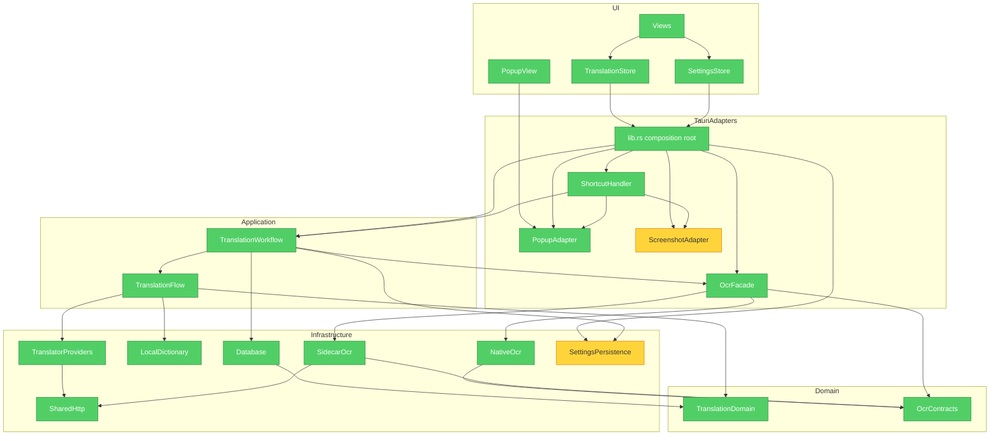

# Brooks-Lint Review

**Mode:** Architecture Audit
**Scope:** Entire project: Vue frontend, Tauri/Rust backend, and OCR/build support scripts; generated binaries, models, caches, and assets excluded
**Health Score:** 89/100
**Trend:** 84 → 89 (+5) since the previous audit; 54 → 89 (+35) from the baseline

The two baseline Critical dependency findings remain eliminated: translation entry points converge on one testable workflow, OCR dependencies flow through neutral contracts without a cycle, and shared HTTP policy now lives in a source-neutral infrastructure module.

---

## Module Dependency Graph

---

## Findings

### 🟡 Warning

**Cognitive Overload / Change Propagation — Screenshot capture remains a 2,016-line subsystem in one module**
Symptom: `src-tauri/src/screenshot.rs` owns public capture APIs, selection payload state, non-Windows WebView selection lifecycle, image encoding, geometry normalization, and a 1,495-line Windows-native selection implementation (`screenshot.rs:93-1986`).
Source: Fowler — Refactoring — Divergent Change; McConnell — Code Complete — High-Quality Routines
Consequence: Platform-specific capture changes and shared selection-contract changes collide in the same module, increasing review surface and making regressions harder to isolate.
Remedy: Split the existing behavior without changing its public API: keep selection contracts and orchestration in `screenshot`, move Windows-native selection to `screenshot/windows.rs`, and move non-Windows WebView selection to its own adapter.

**Knowledge Duplication — Settings schema and defaults have three synchronized representations**
Symptom: the same runtime fields and defaults appear in `settings::PersistedSettings` (`src-tauri/src/settings.rs:15-50`), `app_state::AppConfig` (`src-tauri/src/app_state.rs:21-65`), and frontend `AppSettings/defaultSettings` (`src/lib/settings.ts:3-33`), with explicit field-by-field mapping in `app_state.rs:108-127`.
Source: Hunt & Thomas — The Pragmatic Programmer — DRY; Ousterhout — A Philosophy of Software Design — Information Leakage
Consequence: adding or renaming one setting requires coordinated edits across persistence, runtime state, serialization, and frontend fallback defaults; a missed edit can create silent startup drift.
Remedy: Make `PersistedSettings` the single Rust settings record and store it directly as managed runtime state, separating only truly independent mutable state such as popup/tray lifecycle. Keep the TypeScript boundary shape, but add one serialization-contract fixture generated from Rust instead of repeating defaults manually.

### 🟢 Suggestion

**Accidental Complexity — The composition root also owns all command adapters**
Symptom: `src-tauri/src/lib.rs` is 751 lines: command implementations occupy `lib.rs:49-456`, while `run()` owns application assembly, migration, OCR startup, dictionary initialization, popup prewarming, tray behavior, window events, shortcut registration, and command registration (`lib.rs:458-751`).
Source: Fowler — Refactoring — Divergent Change; Ousterhout — A Philosophy of Software Design — Deep Modules
Consequence: the high fan-out is valid for a composition root, but unrelated command-policy edits and application assembly still share one file, creating avoidable merge and navigation cost.
Remedy: Keep `run()` as the only composition root, but move thin Tauri command adapters into cohesive modules (`translation_commands`, `settings_commands`, `ocr_commands`). Do not introduce another service layer or move business policy out of the workflow.

---

## Summary

The remediation achieved its architectural target: there are no observed module cycles, translation policy is centralized behind explicit gateway seams, persistence records are separated from translation content, popup domain-event ownership is singular, and OCR/provider HTTP policy depends on the neutral `http_client` module. The remaining risks are bounded rather than load-bearing: split the screenshot platform adapters first, then consolidate the duplicated settings representation when that area next changes. The solo-owner repository has no Conway's Law mismatch to report, and the workflow/OCR gateway seams support isolated tests without replacing global infrastructure.
