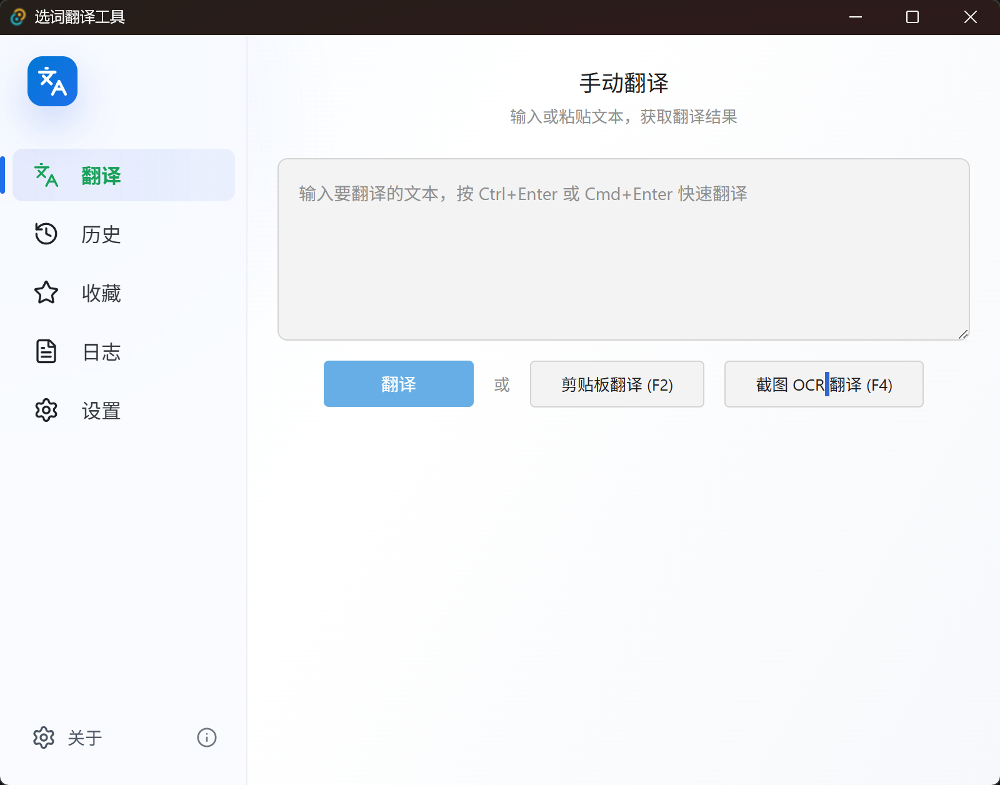
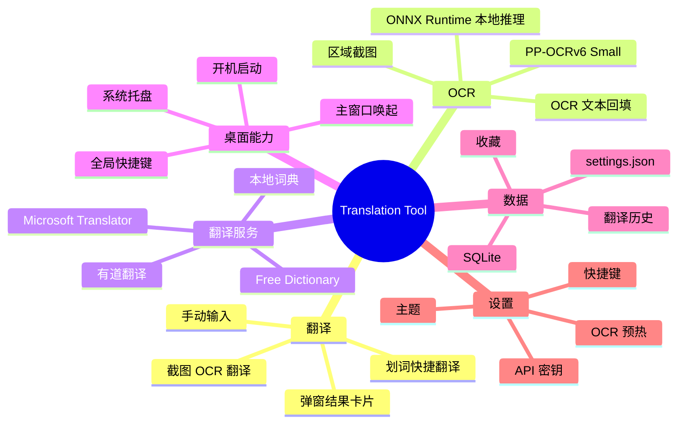
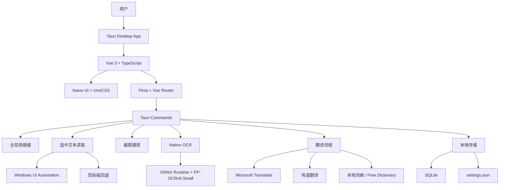
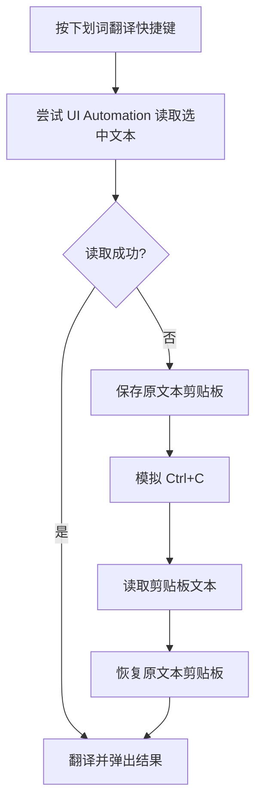

# Translation Recording Tool

一个基于 `Tauri 2 + Vue 3 + Rust + SQLite` 的 Windows 桌面翻译工具，面向日常划词翻译、截图 OCR 翻译、历史记录和本地词典查询。

当前发布版本：`v0.2.1`

- Release: <https://github.com/inorilzy/Translationrecordingtool/releases/tag/v0.2.1>
- 推荐安装包：`translation-tool_0.2.1_x64-setup.exe`
- MSI 安装包：`translation-tool_0.2.1_x64_en-US.msi`

## 产品预览



## 核心能力

- 划词翻译：默认快捷键 `Ctrl+Q`。
- 无剪贴板优先：Windows 下优先使用 UI Automation 直接读取当前选中文本。
- 剪贴板兜底：如果目标应用不支持 UI Automation，会临时模拟 `Ctrl+C`，读取后尽量恢复原文本剪贴板。
- 截图 OCR 翻译：默认快捷键 `Ctrl+Shift+Q`，截图后 OCR、翻译并弹出结果卡片。
- OCR 原文回填：截图 OCR 识别出的文本会同步到主界面输入框，方便手动修正。
- 本地词典优先：单词优先查本地 `ECDICT + WordNet`，再用 Free Dictionary 补全音标、例句等信息。
- 在线翻译：支持有道、Microsoft Translator、Google Translate。
- 历史与收藏：翻译记录、收藏、配置保存在本地。
- 系统托盘：支持关闭时最小化到托盘。

## v0.2.1 亮点

- 新增 Google Translate 配置与调用链路。
- 截图选择防重入：进行中拒绝重复触发，避免叠多层选区。
- 截图右键确认，Esc 仍取消。
- 主题收敛为 Light / Dark，并重做完整暗色 token。
- OCR 只保留原生 ONNX 主线，去掉 sidecar 兼容入口。

## v0.2.0 亮点

- OCR 主线切换为 `ONNX Runtime + PP-OCRv6 small`，不再依赖 Python/PaddleOCR 打包链。
- Windows 安装包体积降到约 `33 MB`。
- 划词翻译新增 Windows UI Automation 读取选区文本，能用时不污染剪贴板。
- 设置页重构为 `Naive UI + UnoCSS + @lucide/vue`。
- 截图 OCR 后会继续自动翻译，同时把 OCR 文本放到主界面输入栏。

## 功能结构



## 架构概览



## 使用说明

### 安装

从 Release 页面下载：

```text
translation-tool_0.2.1_x64-setup.exe
```

普通用户推荐使用 `.exe` 安装包。`.msi` 更适合系统管理、批量部署或自动化安装。

### 配置翻译服务

打开设置页，在“翻译服务”中选择：

- 有道翻译：填写 `App ID` 和 `App Secret`。
- 微软翻译：填写 `Microsoft Translator Key` 和 `Region`。

单词查询会优先走本地词典；句子翻译、本地词典未命中、截图 OCR 翻译结果会使用当前选择的在线翻译服务。

### 划词翻译

1. 在任意应用中选中文字。
2. 按 `Ctrl+Q`。
3. 应用优先尝试通过 Windows UI Automation 读取选中文本。
4. 如果读取失败，自动回退到临时 `Ctrl+C` 并恢复原文本剪贴板。
5. 翻译结果会以弹窗卡片展示。



注意：UI Automation 依赖目标软件暴露选区文本。浏览器、系统输入框、Office、标准控件通常支持较好；图片、视频字幕、游戏、自绘 UI、部分 PDF 页面仍建议用截图 OCR。

### 截图 OCR 翻译

1. 按 `Ctrl+Shift+Q` 或点击截图 OCR 入口。
2. 框选屏幕区域。
3. 识别完成后，OCR 文本会进入主界面输入框。
4. 应用会继续自动翻译，并在截图区域附近弹出翻译卡片。

当前推荐 OCR 引擎为：

```text
native_onnx / PP-OCRv6 small / ONNX Runtime
```

这个方案不需要额外启动 Python OCR 服务。打包版会带上 ONNX Runtime DLL 和 PP-OCRv6 small 模型。

## 技术栈

- 桌面壳：`Tauri 2`
- 前端：`Vue 3`、`TypeScript`、`Pinia`、`Vue Router`
- UI：`Naive UI`、`UnoCSS`、`@lucide/vue`
- 后端：`Rust`
- 数据库：`SQLite`
- OCR：`ONNX Runtime`、`PP-OCRv6 small`
- 翻译服务：有道翻译、Microsoft Translator、Free Dictionary
- 本地词典：`ECDICT`、`WordNet`

## 目录结构

```text
Translationrecordingtool/
├── src/                         # Vue 前端
│   ├── components/              # 公共组件
│   ├── lib/                     # 前端工具与默认配置
│   ├── router/                  # 路由
│   ├── stores/                  # Pinia 状态管理
│   └── views/                   # 主页面、设置页、截图选择页、详情页
├── src-tauri/
│   ├── binaries/                # 打包用原生运行时，如 onnxruntime.dll
│   ├── resources/               # 字典库、OCR 模型等资源
│   ├── src/
│   │   ├── clipboard.rs         # 剪贴板读写和更新等待
│   │   ├── database.rs          # SQLite 翻译记录
│   │   ├── local_dictionary.rs  # 本地词典查询与合并
│   │   ├── native_ocr.rs        # 原生 ONNX OCR
│   │   ├── ocr.rs               # OCR 调用入口
│   │   ├── popup_window.rs      # 弹窗定位和展示
│   │   ├── screenshot.rs        # 截图选择与捕获
│   │   ├── selection_reader.rs  # Windows UI Automation 读取选中文本
│   │   ├── shortcut_handler.rs  # 全局快捷键流程
│   │   └── translator.rs        # 在线翻译服务
│   └── tests/                   # Rust 集成测试
├── scripts/                     # 字典、OCR 模型、运行时准备脚本
├── docs/                        # 项目文档
└── README.md
```

## 开发环境

需要：

- Node.js 18+
- Rust stable
- Tauri 2 Windows 依赖
- PowerShell

安装依赖：

```bash
npm install
```

生成本地词典：

```bash
npm run build:dictionary
```

准备 PP-OCRv6 small 模型和 ONNX Runtime：

```bash
npm run ocr:models:win -- -Profile small
npm run ocr:ort:win
```

启动开发版：

```bash
npm run tauri -- dev --config src-tauri/tauri.ocr-native.conf.json
```

启动细节、成功判断标准，以及**非交互环境**（进程管理器 / CI / 直接 spawn）下为什么不能裸调 `npm` 的说明，见 [docs/dev-startup.md](docs/dev-startup.md)。

## 打包

推荐打包命令：

```bash
npm run tauri:build:ocr:native
```

这个命令会：

1. 准备 PP-OCRv6 small ONNX 模型。
2. 准备 `onnxruntime.dll`。
3. 构建前端。
4. 构建 Tauri release。
5. 生成 Windows `.exe` 和 `.msi` 安装包。

产物位置：

```text
src-tauri/target/release/bundle/nsis/translation-tool_0.2.1_x64-setup.exe
src-tauri/target/release/bundle/msi/translation-tool_0.2.1_x64_en-US.msi
```

## 常用命令

```bash
npm run build:dictionary        # 生成离线 dictionary.db
npm run ocr:models:win          # 准备 OCR 模型
npm run ocr:ort:win             # 准备 ONNX Runtime DLL
npm run tauri:build:ocr:native  # 打包 native ONNX OCR 版本
npm run build                   # 前端构建
npm run test                    # 前端单元测试
npm run tauri dev               # 普通 Tauri 开发模式
cargo check                     # Rust 编译检查
cargo test                      # Rust 测试
```

当前产品仅支持原生 ONNX OCR；不再提供 Paddle/Rapid sidecar 打包路径。

## 数据存储

运行时数据保存在 Tauri 应用数据目录中，主要包括：

- 翻译历史
- 收藏状态
- 用户配置
- OCR/翻译相关运行日志

静态资源包括：

- `src-tauri/resources/dictionary.db`
- `src-tauri/resources/ocr-models/small/**/*`
- `src-tauri/binaries/onnxruntime.dll`

这些大体积生成资源通常不适合直接人工维护，建议通过脚本生成或刷新。

## 已知限制

- UI Automation 不能覆盖所有应用。读不到选中文字时会回退到临时复制。
- 当前只尽量恢复文本剪贴板；如果剪贴板原来是图片或复杂富文本，暂未做完整格式级别保留。
- 截图 OCR 依赖模型能力，复杂背景、小字号、低清晰度图片可能需要手动修正。
- 句子翻译和部分在线补全能力需要外部 API Key。
- 当前主要面向 Windows，其他平台能力尚未完整验证。

## 隐私说明

- 历史记录、收藏和配置默认保存在本机。
- 单词优先查本地词典。
- 句子翻译、本地未命中、截图 OCR 后的翻译会调用当前配置的在线翻译服务。
- API Key 只应保存在本机配置中，不要提交到 Git。

## 许可证

当前仓库尚未包含明确的 license 文件。正式分发或接受外部贡献前，建议补充明确的开源协议。

第三方词典、模型和在线服务请分别遵守各自上游许可：

- ECDICT
- WordNet
- Free Dictionary API
- PP-OCRv6
- ONNX Runtime
