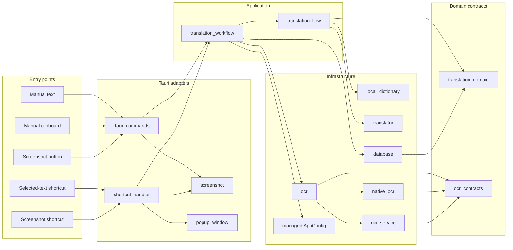

# Translation Workflow Architecture

## Purpose

All translation entry points use one Rust-owned application workflow. The workflow owns translation policy, staged progress, persistence, runtime settings reads, OCR handoff, and cancellation. Frontend code only starts a workflow and renders the persisted record returned by Rust.

## Dependency flow

Dependency direction is entry point → adapter → application workflow → domain contract or infrastructure gateway. `lib.rs` is the composition root; business translation policy belongs in `translation_flow.rs` or `translation_workflow.rs`, not in command handlers or setup code.

## Entry-point contracts

| Entry point | Rust boundary | Input acquisition | Result presentation |
|---|---|---|---|
| Manual text | `translate_text` | Frontend text input | Store receives one persisted `TranslationRecord` |
| Manual clipboard | `translate_from_clipboard` | Rust clipboard adapter | Store receives one persisted `TranslationRecord` |
| Selected-text shortcut | `shortcut_handler::handle_shortcut` | UI Automation, then clipboard fallback | Staged popup updates |
| Screenshot button | `select_screenshot_area`, then `translate_image` | Rust screenshot selection | Store receives one persisted `TranslationRecord`; recognized text backfills the input |
| Screenshot shortcut | `shortcut_handler::handle_screenshot_shortcut` | Rust screenshot selection | OCR, translation, and enrichment stages update one popup |

No entry point sends provider credentials, OCR endpoints, or provider selection from the frontend. `ManagedRuntimeSettings` reads the current Rust-managed `AppConfig` for every request.

## Workflow stages

`WorkflowStage` is the application-level progress contract:

1. `OcrInProgress` for image input.
2. `InputAccepted` after text normalization.
3. `LocalResultAvailable` when the local dictionary provides an immediate result.
4. `EnrichmentAvailable` when free dictionary data enriches the local result.
5. `RemoteTranslationInProgress` before a configured provider call.
6. `Completed` with the final persisted record.
7. `Cancelled` or `Failed` as terminal non-success states.

The workflow persists the first usable result before publishing it. Later enrichment updates the same record without incrementing its access count. Entry points must not call a separate save command.

## Record ownership

- `translation_domain::TranslationResult` contains translation content only.
- `database::TranslationRecord` adds persistence identity, favorite state, access count, and timestamps.
- `database` performs explicit conversion between domain results and persistence records.
- Frontend `translation-records.ts` mirrors the serialized persisted record and owns only client-side merge helpers.

## OCR boundary

- `ocr_contracts` owns engine-independent runtime configuration and status records.
- `ocr` exposes the native ONNX façade used by the workflow and settings commands.
- `native_ocr` owns in-process ONNX execution.
- Compatibility sidecars are no longer product options; legacy `paddleocr` / `rapidocr` values migrate to `native_onnx`.

Packaging profile:

- `tauri.ocr-native.conf.json`: selects `native_onnx` with packaged `small` PP-OCRv6 models and `onnxruntime.dll`.

Persisted `ocrEngine` / `ocrModelProfile` values are normalized to native ONNX (`tiny` / `small` / `medium`). Missing packaged models fail before recognition with the selected profile in the error or status.

## Popup ownership

`PopupWindow.vue` is the only owner of translation and theme event subscriptions for the popup. `popup-window-controls.ts` owns only window mechanics: ready signaling, Escape/close, drag, and cleanup. Ready signaling happens after all listeners are registered and propagates failures; the popup renders a terminal error when the backend cannot be notified. Rust flushes deferred stages only after receiving `popup-ready`. Rust also owns request freshness through `PopupRuntimeState`; stale requests cannot publish later stages.

## Change rules

1. Add a translation input source by adapting it to `TranslationWorkflow::translate_text` or `translate_image`.
2. Add provider policy in `translation_flow` behind `ProviderGateway`; do not branch in Vue or command handlers.
3. Add OCR engines behind `ocr` and `OcrGateway`, using records from `ocr_contracts`.
4. Persist only through `TranslationRepository`; callers consume the returned `TranslationRecord`.
5. Keep popup translation events in `PopupWindow.vue`; window chrome must not subscribe to domain events.
